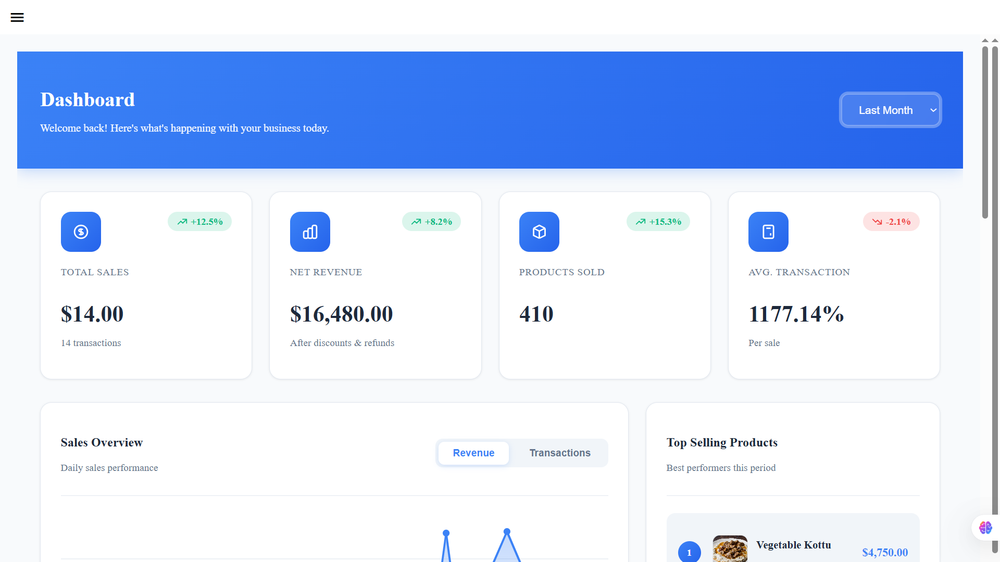
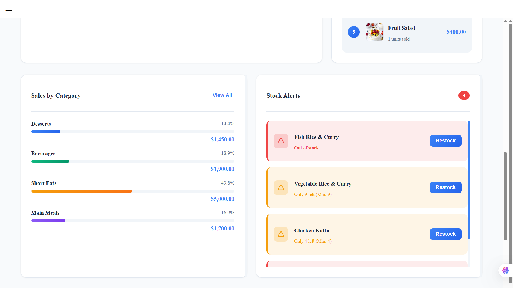
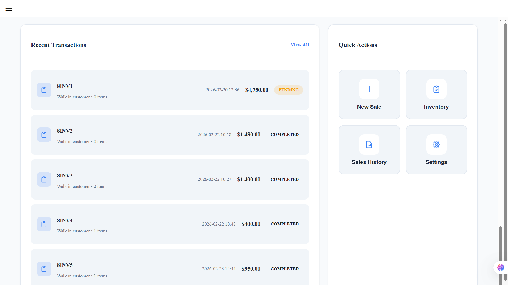
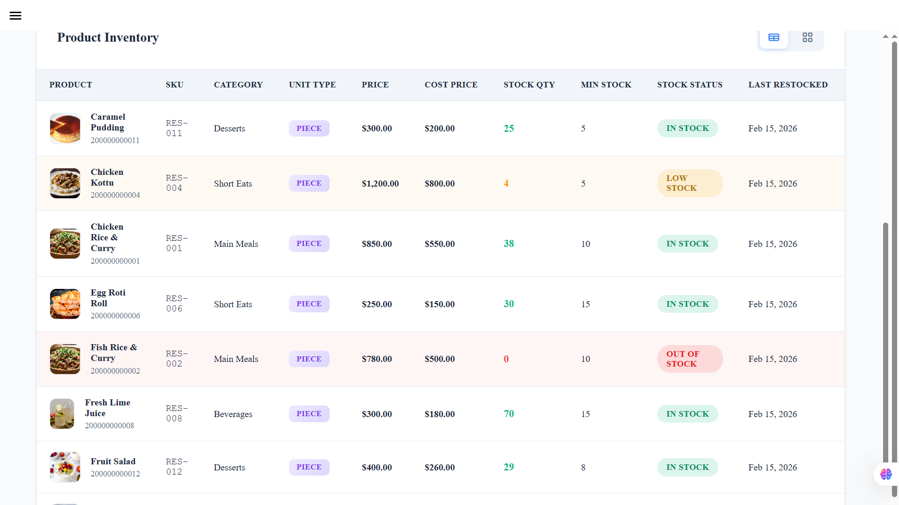
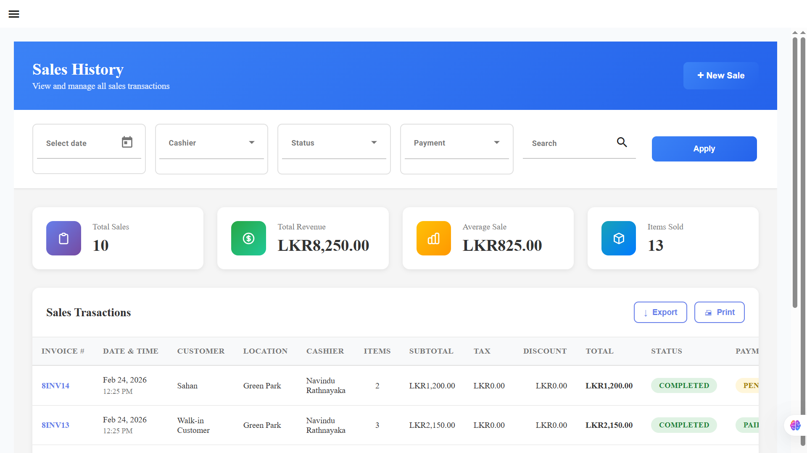
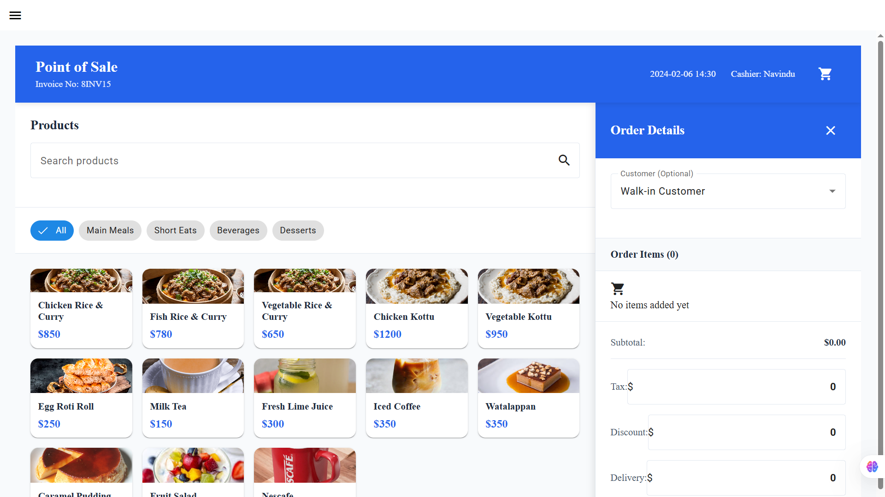
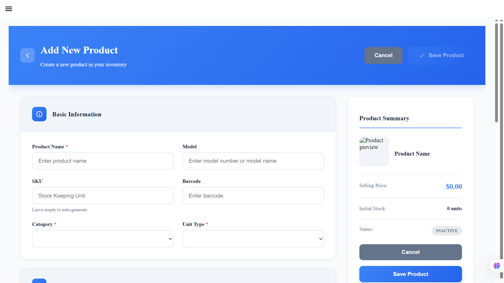

# Vendora POS System

Multi-tenant Point of Sale system with comprehensive inventory management, sales tracking, and JWT authentication built using Spring Boot and Angular.

[](https://spring.io/projects/spring-boot)
[](https://angular.io/)
[](https://www.typescriptlang.org/)
[](https://www.postgresql.org/)

---

## 🚀 Overview

Vendora is a modern, cloud-ready POS system designed for multi-tenant retail businesses. Built with enterprise-grade architecture, it offers real-time inventory tracking, comprehensive sales analytics, and secure authentication.

### Key Features

- 🏢 **Multi-Tenancy** - Isolated data for multiple businesses on a single platform
- 📊 **Real-time Dashboard** - Live sales analytics and business metrics
- 📦 **Inventory Management** - Track stock levels, low stock alerts, product variations
- 💰 **Sales Processing** - Fast POS interface with multiple payment methods
- 📈 **Sales History** - Comprehensive transaction history with filters
- 👥 **Customer Management** - Track customer purchases and preferences
- 🔐 **JWT Authentication** - Secure, token-based authentication
- 📱 **Responsive Design** - Works seamlessly on desktop, tablet, and mobile

---

## 📸 Screenshots

### Dashboard
Real-time business metrics, sales overview, and quick actions.





### Inventory Management
Comprehensive product catalog with stock tracking and low-stock alerts.



### Sales History
Track all transactions with advanced filtering and export capabilities.



### Point of Sale
Fast, intuitive interface for processing customer orders.



### Product Management
Add and manage products with detailed information including pricing, inventory, and pharmacy data.



---

## 🛠️ Tech Stack

### Backend
- **Spring Boot 3.x** - Core framework
- **Spring Security** - JWT authentication & authorization
- **Spring Data JPA** - Database abstraction
- **PostgreSQL** - Primary database
- **Hibernate** - ORM
- **Maven** - Dependency management

### Frontend
- **Angular 17.x** - Frontend framework
- **TypeScript** - Programming language
- **Angular Material** - UI components
- **RxJS** - Reactive programming
- **SCSS** - Styling

### Architecture
- **Multi-tenant** - Separate data per business
- **RESTful API** - Standard HTTP methods
- **JWT** - Stateless authentication
- **MVC Pattern** - Clean separation of concerns

---

## 📋 Prerequisites

Before running this project, ensure you have:

- **Java 17+** installed
- **Node.js 18+** and npm installed
- **PostgreSQL 15+** database server
- **Maven 3.8+** for backend
- **Angular CLI** for frontend

---

## ⚙️ Installation & Setup

### 1. Clone the Repository

```bash
git clone https://github.com/Navi9x/vendora-pos-system.git
cd vendora-pos-system
```

### 2. Backend Setup

#### Configure Database

Create a PostgreSQL database:

```sql
CREATE DATABASE vendora_pos;
CREATE USER vendora_user WITH PASSWORD 'db_password';
GRANT ALL PRIVILEGES ON DATABASE vendora_pos TO vendora_user;
```

#### Update Application Properties

Edit `src/main/resources/application.properties`:

```properties
# Database Configuration
spring.datasource.url=jdbc:postgresql://localhost:5432/vendora_pos
spring.datasource.username=vendora_user
spring.datasource.password=db_password

# JWT Configuration
jwt.secret=secret-key-here
jwt.expiration=86400000

# Server Port
server.port=8080
```

#### Run Backend

```bash
cd backend
mvn clean install
mvn spring-boot:run
```

Backend will start at `http://localhost:8080`

### 3. Frontend Setup

#### Install Dependencies

```bash
cd frontend
npm install
```

#### Update API Endpoint

Edit `src/environments/environment.ts`:

```typescript
export const environment = {
  production: false,
  apiUrl: 'http://localhost:8080/api'
};
```

#### Run Frontend

```bash
ng serve
```

Frontend will start at `http://localhost:4200`

---

## 🗂️ Project Structure

```
vendora-pos-system/
├── backend/
│   ├── src/
│   │   ├── main/
│   │   │   ├── java/com/vendora/pos/
│   │   │   │   ├── config/          # Security, JWT configs
│   │   │   │   ├── controller/      # REST endpoints
│   │   │   │   ├── dto/             # Data Transfer Objects
│   │   │   │   ├── entity/          # JPA entities
│   │   │   │   ├── repository/      # Database repositories
│   │   │   │   ├── service/         # Business logic
│   │   │   │   └── security/        # Auth components
│   │   │   └── resources/
│   │   │       └── application.properties
│   │   └── test/
│   └── pom.xml
│
├── frontend/
│   ├── src/
│   │   ├── app/
│   │   │   ├── components/
│   │   │   │   ├── dashboard/
│   │   │   │   ├── inventory/
│   │   │   │   ├── sales/
│   │   │   │   ├── sales-history/
│   │   │   │   └── products/
│   │   │   ├── services/
│   │   │   ├── models/
│   │   │   └── guards/
│   │   ├── assets/
│   │   └── environments/
│   ├── angular.json
│   └── package.json
│
└── README.md
```

---

## 🔑 API Endpoints

### Authentication
```
POST   /api/auth/login          - User login
POST   /api/auth/register       - User registration
POST   /api/auth/refresh        - Refresh JWT token
```

### Sales
```
GET    /api/sales               - Get all sales (paginated)
POST   /api/sales               - Create new sale
GET    /api/sales/{id}          - Get sale by ID
GET    /api/sales/invoice/{invoiceNumber} - Get sale by invoice
```

### Inventory
```
GET    /api/inventory           - Get all inventory (paginated)
POST   /api/inventory           - Add new product
PUT    /api/inventory/{id}      - Update product
DELETE /api/inventory/{id}      - Delete product
POST   /api/inventory/restock   - Restock product
```

### Products
```
GET    /api/products            - Get all products
GET    /api/products/{id}       - Get product by ID
GET    /api/products/sku/{sku}  - Get product by SKU
```

### Dashboard
```
GET    /api/dashboard/stats     - Get dashboard statistics
GET    /api/dashboard/recent-transactions - Recent sales
GET    /api/dashboard/top-products - Top selling products
```

---

## 🔐 Authentication Flow

1. User logs in with credentials
2. Backend validates and returns JWT token
3. Frontend stores token in localStorage
4. Token included in Authorization header for all requests
5. Backend validates token on each request
6. Token expires after 24 hours (configurable)

---

## 🌟 Core Features Explained

### Multi-Tenancy
Each business has isolated data using a `business_id` field in all tables. Row-level security ensures data separation.

### Inventory Management
- Real-time stock tracking
- Low stock alerts (configurable thresholds)
- Product variants (size, color, etc.)
- Barcode/SKU support
- Image upload support

### Sales Processing
- Fast product search
- Multiple payment methods (Cash, Card, Digital Wallet)
- Customer assignment (optional)
- Order types (Dine-in, Takeaway, Delivery)
- Automatic invoice generation

### Dashboard Analytics
- Total sales & revenue
- Products sold count
- Average transaction value
- Sales trends (daily, weekly, monthly)
- Top selling products
- Category-wise breakdown
- Stock alerts

---

## 🧪 Testing

### Backend Tests
```bash
cd backend
mvn test
```

### Frontend Tests
```bash
cd frontend
npm test
```

---

## 🚢 Deployment

### Backend (Spring Boot)

#### Build JAR
```bash
mvn clean package
```

#### Run JAR
```bash
java -jar target/vendora-pos-0.0.1-SNAPSHOT.jar
```

### Frontend (Angular)

#### Build for Production
```bash
ng build --configuration production
```

Deploy the `dist/` folder to your web server (Nginx, Apache, etc.)

---

## 🤝 Contributing

Contributions are welcome! Please follow these steps:

1. Fork the repository
2. Create a feature branch (`git checkout -b feature/AmazingFeature`)
3. Commit your changes (`git commit -m 'Add some AmazingFeature'`)
4. Push to the branch (`git push origin feature/AmazingFeature`)
5. Open a Pull Request

---

## 📝 License

This project is licensed under the MIT License - see the [LICENSE](LICENSE) file for details.

---

## 👨‍💻 Author

**Your Name**
- GitHub: [@yourusername](https://github.com/yourusername)
- LinkedIn: [Your LinkedIn](https://linkedin.com/in/yourprofile)

---

## 🙏 Acknowledgments

- Spring Boot team for the excellent framework
- Angular team for the powerful frontend framework
- All open-source contributors

---

## 📧 Support

For support, email support@vendora.com or create an issue in this repository.

---

## 🗺️ Roadmap

- [ ] Mobile app (React Native)
- [ ] Multi-language support
- [ ] Advanced reporting & analytics
- [ ] Integration with payment gateways
- [ ] Barcode scanner support
- [ ] Cloud deployment guides
- [ ] Docker containerization
- [ ] Customer-facing e-commerce platform

---

**Made with ❤️ for small businesses in Sri Lanka**
